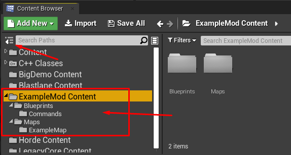
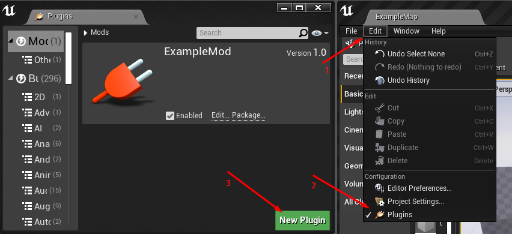
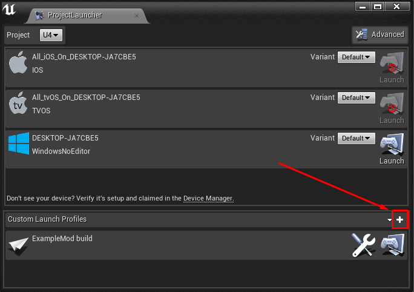
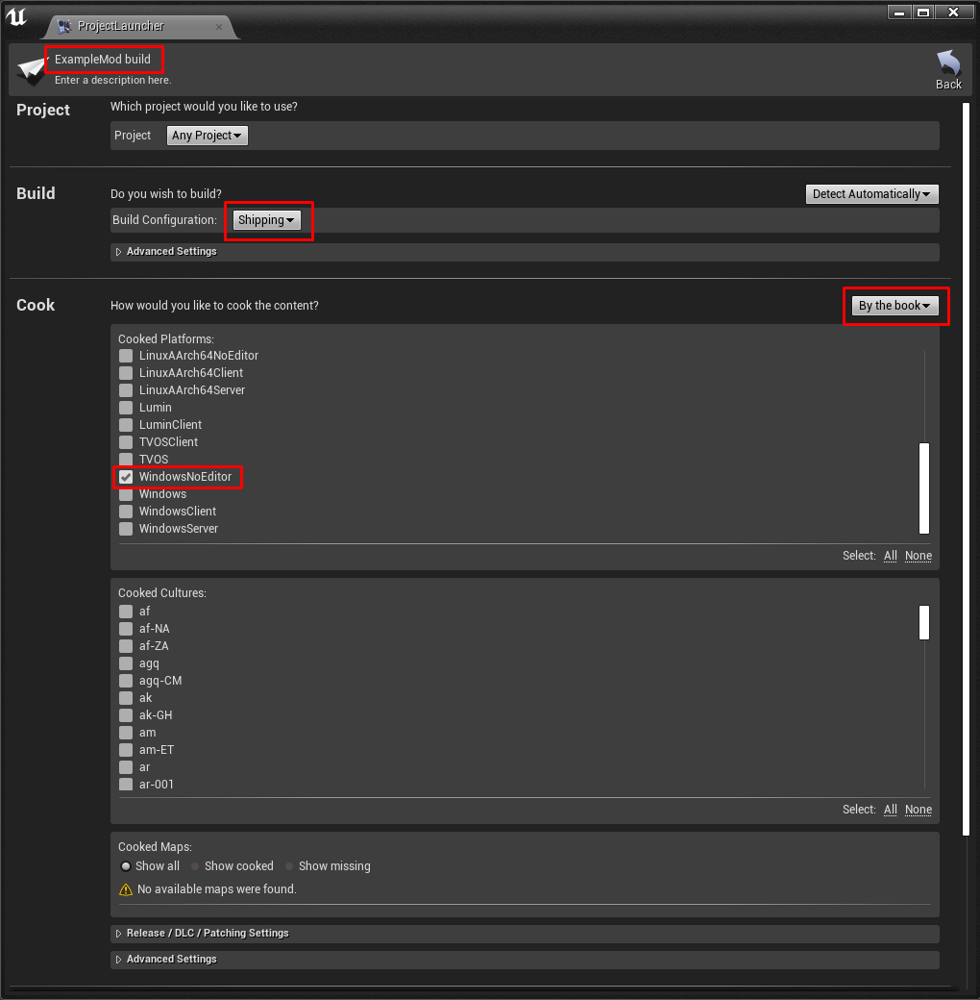
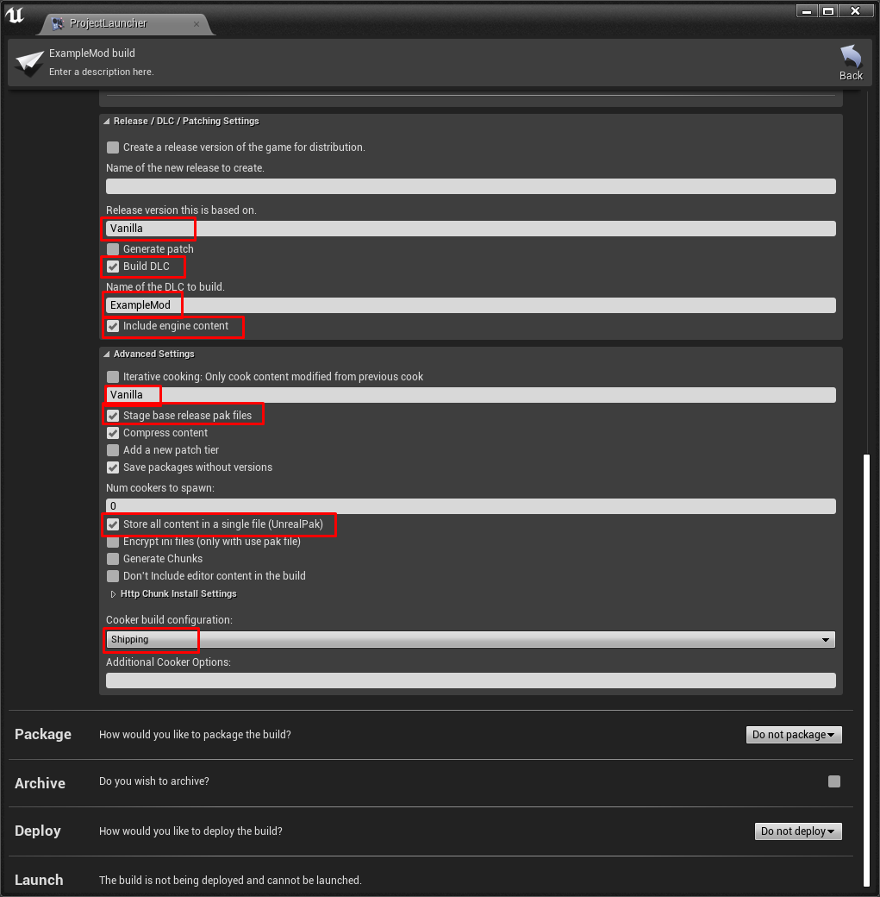
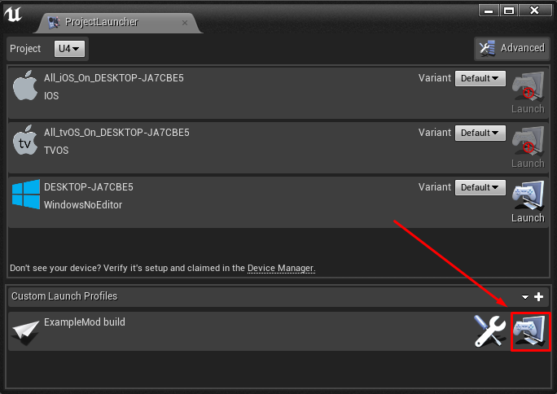

# unturned4-mod-example

The first-ever modding tutorial for Unturned II.

Note that this is not the official (made by SDG) modding tool. At this time, you can only create maps
and ([with some issues](#but)) commands.

## Prerequisites

- Unreal Engine (To find the version: Right click on the U4.exe > Properties > Details)

## Create a mod

1. Open `src/U4.uproject`.
2. View examples in `ExampleMod Content` folder.
   
3. Create a plugin under Edit > Plugin > New Plugin using the 'Content Only' template. Make sure it is enabled.
   
4. Open the project's directory. Move your newly created plugin's folder from `Plugins/` to `Mods/`.
5. Restart the editor.

## List your map in the game's main menu

To make your map listed in the main menu, create a Level Definition DataAsset
(see `ExampleMod/Maps/ExampleMap/LD_ExampleMap` for example). Right click on the Content Browser window >
Miscellaneous > DataAsset.

Select `U4_LevelDefinition` class.

Configure created asset.

## Create a command

1. Right click on the Content Browser window > Blueprint class.
2. Select `U4_AdminCommand` class.
   
3. Add 'Execute Command' event and implement it.
   

### But...

There's a problem with commands: they do not seem to auto-register (should they?) like maps do. The workaround is to add
them manually to the `U4_GameModeBase`, but then vanilla commands (e.g. help, time) stops working. Don't know what I did
wrong. Maybe they need to be registered manually too.

## Build

1. Open Window > Project Launcher.
2. Create a Custom Launch Profile.
   
3. Configure like on screenshots below but change name of the mod.
   
   
4. Press 'Launch this profile' button and wait for the build to complete.
   
5. Copy the exported folder
   from `(project directory)/Mods/(your mod name)/Saved/StagedBuilds/WindowsNoEditor/U4/Mods/(your mod name)`.
6. Create a folder named `Mods` in the game's `U4` folder.
   
7. Paste the `(your mod name)` folder into the game's `U4/Mods` folder.
   
8. Run the game.

## Assets documentation

See [Unturned II modding docs](https://wiki.smartlydressedgames.com/wiki/Modding).

## Good luck
