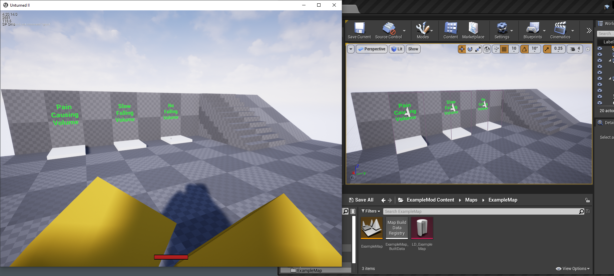
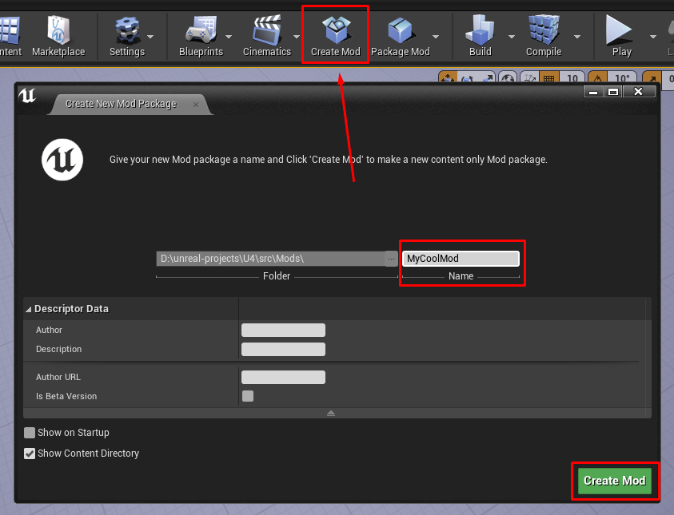
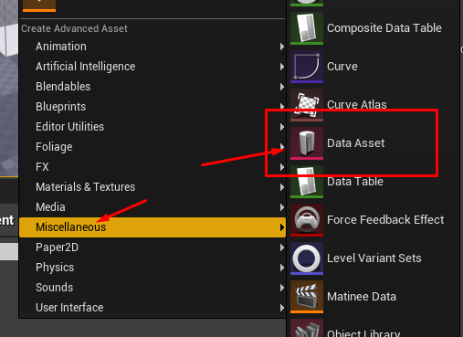
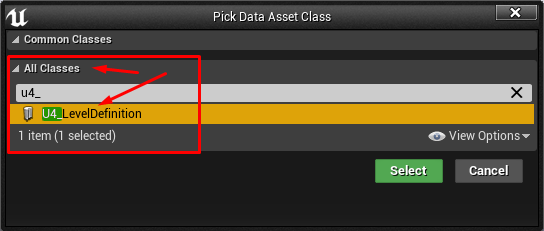
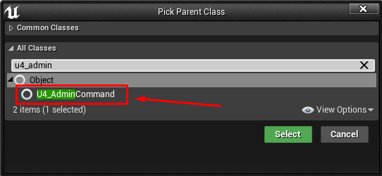
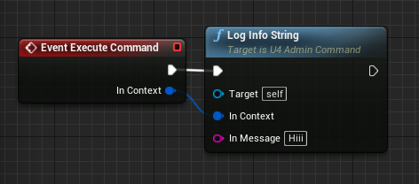
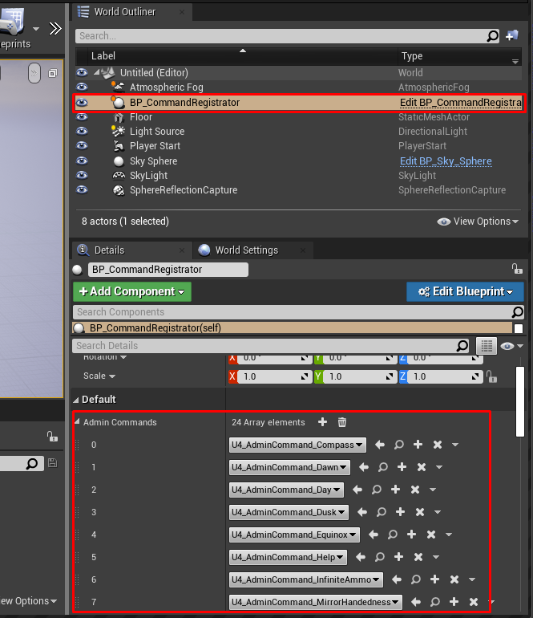
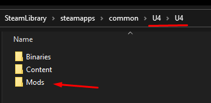
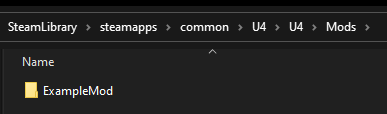

# unturned4-mod-example

The first-ever modding tutorial for Unturned II.

Note that this is not the official (made by SDG) modding tool. It was made by reverse engineering the game's code. At
this time, it's only possible to create maps and commands.

## Prerequisites

- Unreal Engine (To find the version: Right click on the U4.exe > Properties > Details)

## Create a mod

Click the 'Create Mod' button on the toolbar. In the opened window, give your new Mod a name. Click 'Create Mod' in the
right bottom corner.

## List your map in the game's main menu

To do so, create the Level Definition DataAsset
(see `ExampleMod/Maps/ExampleMap/LD_ExampleMap` for example). Right click on the Content Browser window >
Miscellaneous > DataAsset.

Select `U4_LevelDefinition` class.

Configure created asset.

## Create a command

1. Right click on the Content Browser window > Blueprint class.

2. Select `U4_AdminCommand` class.

   

3. Add 'Execute Command' event and implement it.

   

4. To make commands usable, you need to register them: create an instance
   of `ExampleMod/Blueprints/BP_CommandRegistrator` on your map and select what commands you want.

   

## Package

1. Click the 'Package Mod' button on the toolbar and select which one to build.

   

2. Copy the exported folder from `src/Mods/(your mod name)/Saved/StagedBuilds/WindowsNoEditor/U4/Mods/(your mod name)`.

3. Create a folder named `Mods` in the game's `U4` folder.

   

4. Paste the `(your mod name)` folder into the game's `U4/Mods` folder.

   

5. Run the game.

## Assets documentation

See [Unturned II modding docs](https://wiki.smartlydressedgames.com/wiki/Modding).

## Good luck
