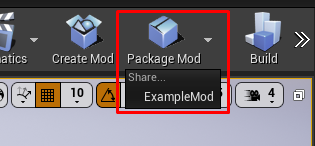

# unturned4-mod-example

The first-ever modding tutorial for Unturned II.

Note that this is not the official modding tool. It was made by reverse engineering the game's code. Be aware of
possible breaking changes. At this time, it's only possible to create maps and commands.

## Prerequisites

- Unreal Engine (To find the version: Right click on the U4.exe > Properties > Details)

## Create a mod

Click the 'Create Mod' button on the toolbar. In the opened window, give your new Mod a name. Click 'Create Mod' in the
right bottom corner.

## List your map in the game's main menu

There are 2 **IMPORTANT** things:

### Level Definition

You need to create the Level Definition Data Asset (see `ExampleMod/Maps/ExampleMap/LevelDefinition_ExampleMap` for
example). Right click on the Content Browser window > Miscellaneous > DataAsset.

Select the `U4_LevelDefinition` class.

Configure the created asset.

### Location

The definition created in the previous step must be in a subfolder under `(your mod's content folder)/Maps/`.

Good: `MyCoolMod/Maps/CoolMap/LevelDefinition_CoolMap`

Bad: `MyCoolMod/Maps/LevelDefinition_CoolMap`

Bad: `MyCoolMod/LevelDefinition_CoolMap`

## Create a command

1. Right click on the Content Browser window > Blueprint class.

2. Select the `U4_AdminCommand` class.

   

3. Add the 'Execute Command' event and implement it.

   

4. To make commands usable, you need to register them first: create an instance
   of `/Content/ModsCommon/Blueprints/BP_CommandRegistrator` on your map and select what commands you want.

   

## Package

1. Click the 'Package Mod' button on the toolbar and select which one to build.

   

2. Copy the exported folder from `src/Mods/(your mod name)/Saved/StagedBuilds/WindowsNoEditor/U4/Mods/(your mod name)`.

3. Create a folder named `Mods` in the game's `U4` folder.

   

4. Paste the `(your mod name)` folder into the game's `U4/Mods`.

   

5. Run the game.

## Useful links

For best practices and documentation see Unturned II's [modding wiki](https://wiki.smartlydressedgames.com/wiki/Modding)
.

## Good luck
